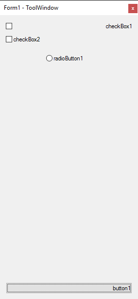
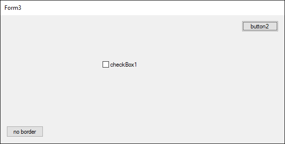
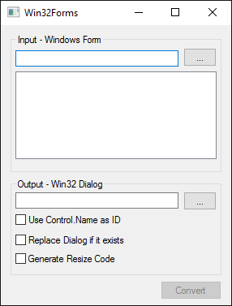

# Win32Forms
Converts simple Windows Forms to Win32 Dialogs.

### Description

I like to use raw Win32 to implement tiny background applications, which should use as less dependencies as possible. However, usually they should have a small settings dialog or something similar. I don't like to use the Visual C++ Dialog Editor, that's why I wrote this little helper. It can convert .NET Windows Forms into Win32 Dialogs. Of course, .NET Windows Forms are very complex components, therefore only a fraction of its possibilities can be converted. For example, WinForms have a clever way to resize its UI when the window is resized. These kind of things have to be implemented by hand in Win32. However, simple user interfaces can be converted, nonetheless.

### Supported controls

Note: Not all properties are converted!

* Form
* Button
* TextBox
* Label
* GroupBox
* CheckBox
* RadioButton
* ComboBox
* ListBox

### How to use

1. Create a user interface in a Windows Forms application and build it.

2. Start Win32Forms and load the binary, selected the desired Form in the list.

3. Choose an output file. This can either be an existing Resource File (.rc) or a new one.

4. Click Convert, the newly created dialog will be embedded in the output file.

5. Reload or Add the Resource File in Visual C++.

6. Hope that no error occurred :-)   in case something went wrong, a backup file has been created.

### Samples

###### Sample 1

###### Sample 2

###### Sample 3

###### Sample 4

