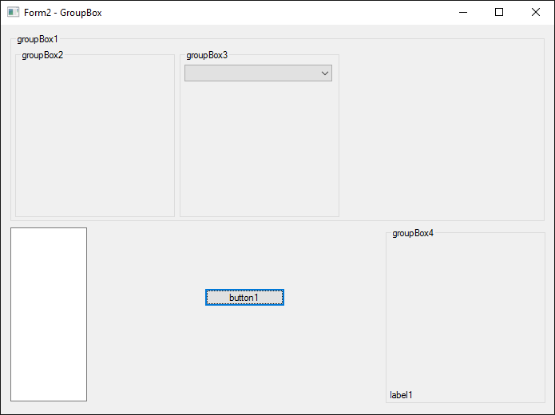
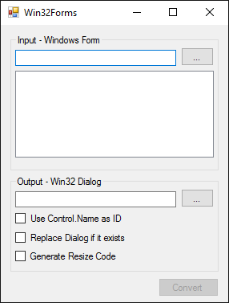

# Win32Forms
Converts simple Windows Forms to Win32 Dialogs.

### Description

I like to use raw Win32 to implement tiny background applications, which should use as less dependencies as possible. However, usually they should have a small settings dialog or something similar. I don't like to use the Visual C++ Dialog Editor, that's why I wrote this little helper. It can convert .NET Windows Forms into Win32 Dialogs. Of course, .NET Windows Forms are very complex components, therefore only a fraction of its possibilities can be converted. For example, WinForms have a clever way to resize its UI when the window is resized. These kind of things have to be implemented by hand in Win32. However, simple user interfaces can be converted, nonetheless.

### Supported controls

Note: Not all properties are converted!

* Form
* Button
* TextBox
* Label
* GroupBox
* CheckBox
* RadioButton
* ComboBox
* ListBox

### How to use

1. Create a user interface in a Windows Forms application and build it.

2. Start Win32Forms and load the binary, selected the desired Form in the list.

3. Choose an output file. This can either be an existing Resource File (.rc) or a new one.

4. Click Convert, the newly created dialog will be embedded in the output file.

5. Reload or Add the Resource File in Visual C++.

6. Hope that no error occurred :-)   in case something went wrong, a backup file has been created.

### Samples

###### Sample 1

Windows Forms


Win32 Dialog


```
IDD_DIALOG DIALOGEX 0, 0, 189, 359
STYLE DS_SETFONT | WS_POPUP | WS_CAPTION | WS_SYSMENU
EXSTYLE WS_EX_TOOLWINDOW
CAPTION "Form1 - ToolWindow"
FONT 8, "MS Shell Dlg", 0, 0, 0x1
BEGIN
    PUSHBUTTON      "button1",IDC_BUTTON1,8,338,173,14,BS_RIGHT
    CONTROL         "radioButton1",IDC_RADIO1,"Button",BS_AUTORADIOBUTTON,63,50,57,10
    CONTROL         "checkBox2",IDC_CHECK1,"Button",BS_AUTOCHECKBOX,8,26,53,10
    CONTROL         "checkBox1",IDC_CHECK2,"Button",BS_AUTOCHECKBOX | BS_RIGHT,8,7,173,15
END
```

###### Sample 2

Windows Forms


Win32 Dialog - In this sample the ProgressBar which is below button1 is not converted because the control is not supported.



```
IDD_DIALOG DIALOGEX 0, 0, 462, 300
STYLE DS_SETFONT | WS_POPUP | WS_THICKFRAME | WS_CAPTION | WS_SYSMENU | WS_MINIMIZEBOX | WS_MAXIMIZEBOX
EXSTYLE WS_EX_APPWINDOW
CAPTION "Form2 - GroupBox"
FONT 8, "MS Shell Dlg", 0, 0, 0x1
BEGIN
    PUSHBUTTON      "button1",IDC_BUTTON1,170,203,67,14
    EDITTEXT        IDC_EDIT1,8,156,64,134,ES_MULTILINE
    GROUPBOX        "groupBox4",IDC_STATIC,321,156,133,136
    LTEXT           "label1",IDC_STATIC,325,281,23,8
    GROUPBOX        "groupBox1",IDC_STATIC,8,7,446,145
    GROUPBOX        "groupBox3",IDC_STATIC,149,19,133,130
    COMBOBOX        IDC_COMBO1,153,31,123,10,CBS_DROPDOWNLIST
    GROUPBOX        "groupBox2",IDC_STATIC,12,19,133,130
END
```

###### Sample 3

Windows Forms


Win32 Dialog - In this sample the border should be invisible, but there is still a bug...


```
IDD_DIALOG DIALOGEX 0, 0, 384, 161
STYLE DS_SETFONT | WS_POPUP
EXSTYLE WS_EX_APPWINDOW
CAPTION "Form3"
FONT 8, "MS Shell Dlg", 0, 0, 0x1
BEGIN
    CONTROL         "checkBox1",IDC_CHECK1,"Button",BS_AUTOCHECKBOX,138,57,53,10
    PUSHBUTTON      "button2",IDC_BUTTON1,326,7,50,14
    PUSHBUTTON      "no border",IDC_BUTTON2,8,139,50,14
END
```

###### Sample 4

Windows Forms



Win32 Dialog


```
IDD_DIALOG DIALOGEX 0, 0, 189, 204
STYLE DS_SETFONT | WS_POPUP | WS_THICKFRAME | WS_CAPTION | WS_SYSMENU | WS_MINIMIZEBOX | WS_MAXIMIZEBOX
EXSTYLE WS_EX_APPWINDOW
CAPTION "Win32Forms"
FONT 8, "MS Shell Dlg", 0, 0, 0x1
BEGIN
    PUSHBUTTON      "Convert",IDC_BUTTON1,131,182,50,14,WS_DISABLED
    GROUPBOX        "Output - Win32 Dialog",IDC_STATIC,8,116,173,63
    CONTROL         "Replace Dialog if it exists",IDC_CHECK1,"Button",BS_AUTOCHECKBOX,13,158,96,10
    CONTROL         "Use Control.Name as ID",IDC_CHECK2,"Button",BS_AUTOCHECKBOX,12,143,93,10
    PUSHBUTTON      "...",IDC_BUTTON2,150,126,27,14
    EDITTEXT        IDC_EDIT1,12,127,131,10
    GROUPBOX        "Input - Windows Form",IDC_STATIC,8,7,173,105
    LISTBOX         IDC_LIST1,12,35,163,64
    PUSHBUTTON      "...",IDC_BUTTON3,150,17,27,14
    EDITTEXT        IDC_EDIT2,12,19,131,10
END
```

Win32 Dialog (resized)

